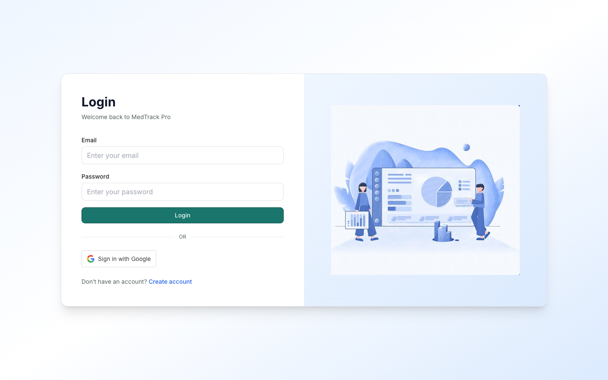
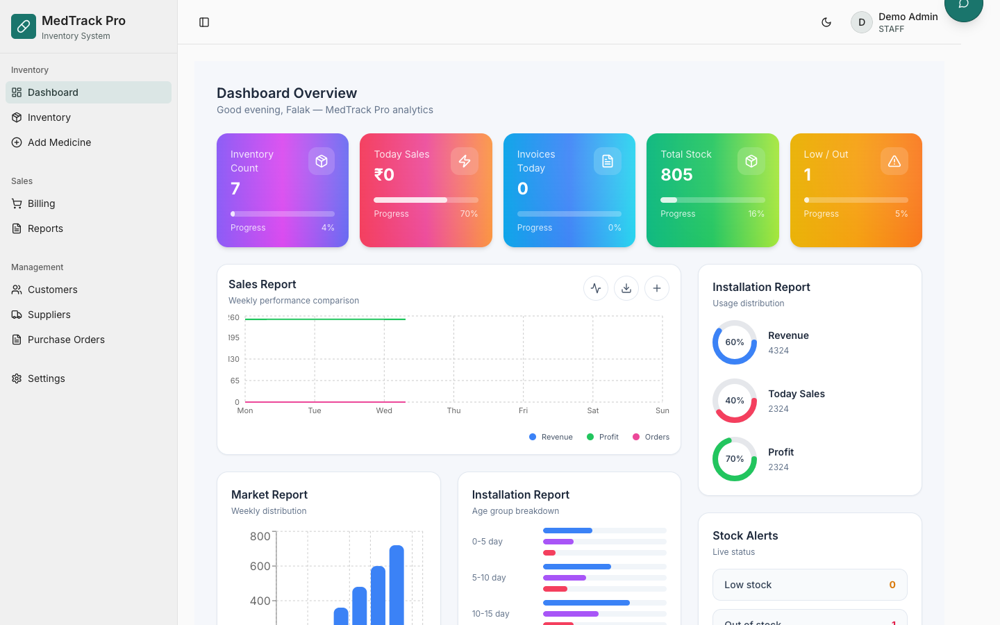
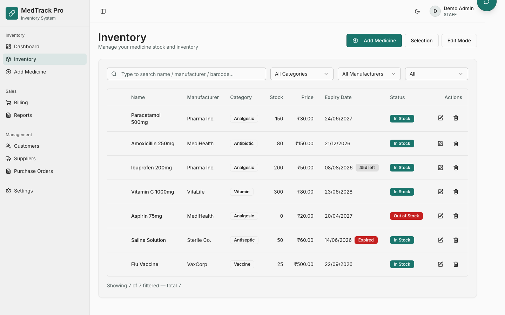
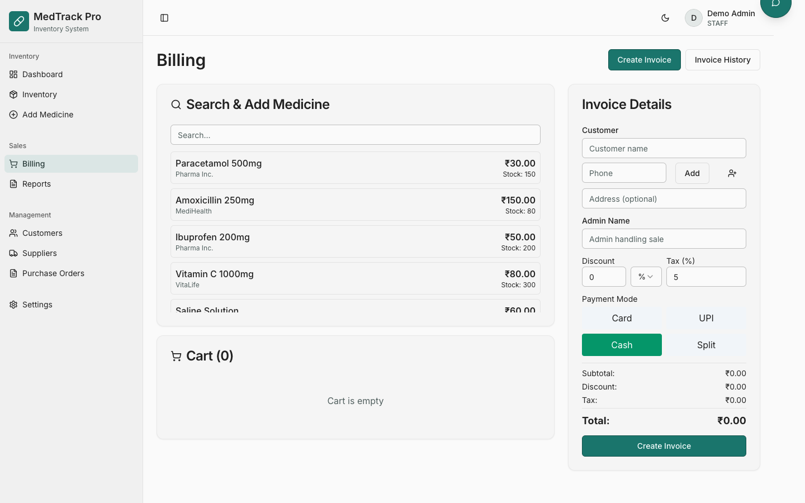
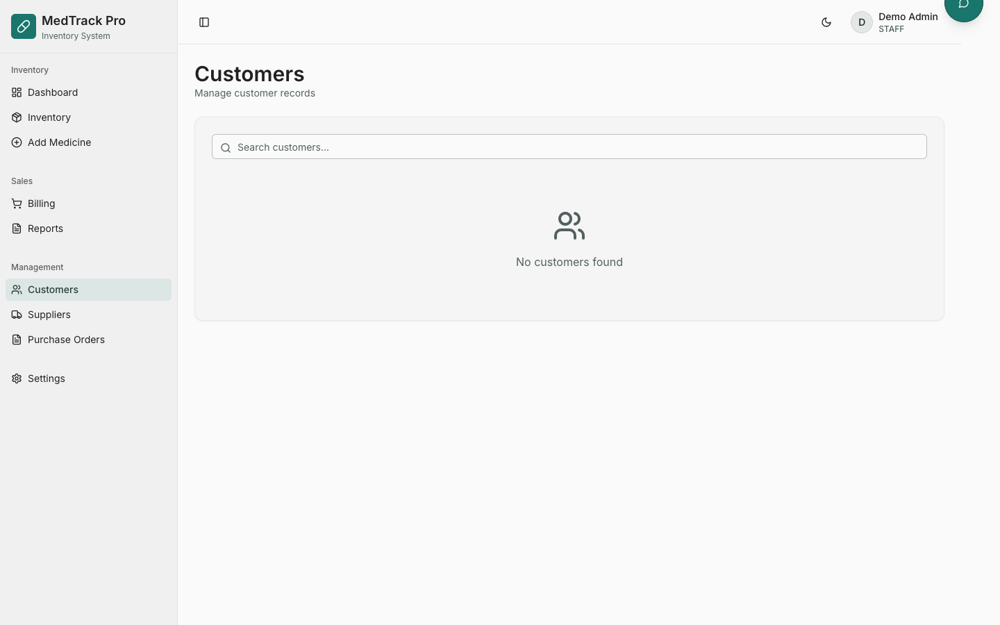
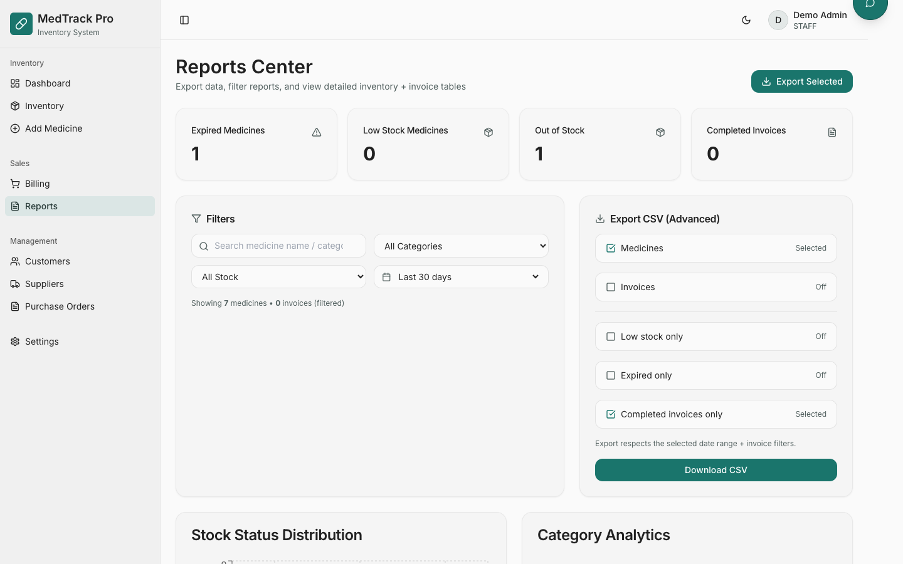

# MedTrack Pro

> **Live Demo:** [https://med-track-pro.vercel.app](https://med-track-pro.vercel.app)

A full-stack pharmacy inventory management system with billing, customer management, supplier tracking, purchase orders, and reporting.

---

## Demo Account

Instantly explore all features without registering:

| Field    | Value                     |
| -------- | ------------------------- |
| Email    | `demo@medtrackpro.com`    |
| Password | `Demo@123`                |

Click **"Try Demo Account"** on the login page to auto-fill and sign in.

---

## Screenshots

| Login Page                                | Dashboard                                 |
| ----------------------------------------- | ----------------------------------------- |
|          |  |

| Inventory                                 | Billing                                   |
| ----------------------------------------- | ----------------------------------------- |
|  |      |

| Customers                                 | Reports                                   |
| ----------------------------------------- | ----------------------------------------- |
|  |      |

---

## Tech Stack

- **Frontend:** React, TypeScript, Vite, Tailwind CSS, wouter
- **Backend:** Express, TypeScript
- **Database:** Neon (PostgreSQL) via drizzle ORM
- **Deployment:** Vercel (serverless functions + static files)
- **Authentication:** Google OAuth 2.0 + email/password

---

## Local Development

```bash
# Install dependencies
npm install

# Start development server
npm run dev
```

The app runs on `http://localhost:5000`.

---

## Deployment

```bash
# Deploy to Vercel
npx vercel --prod
```
